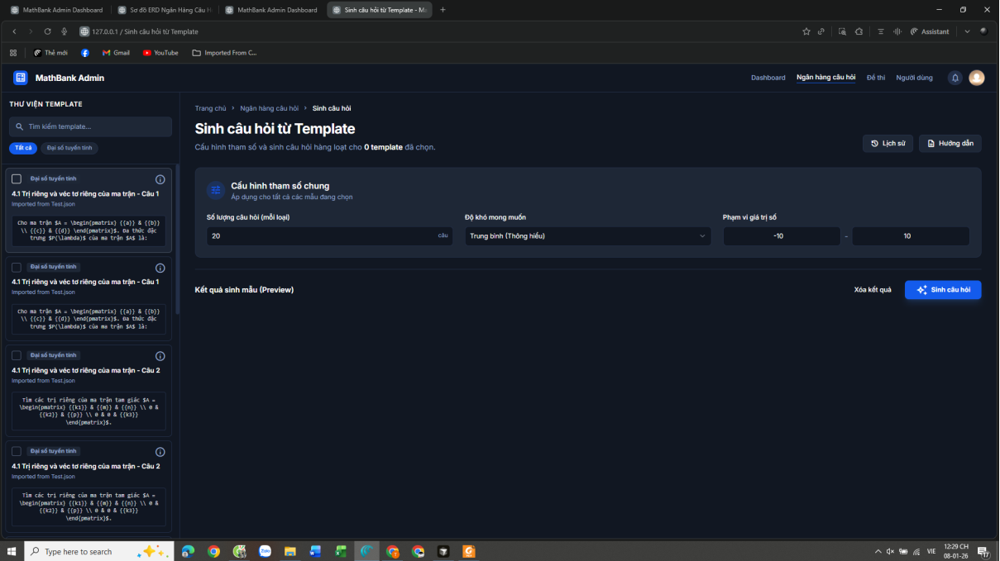
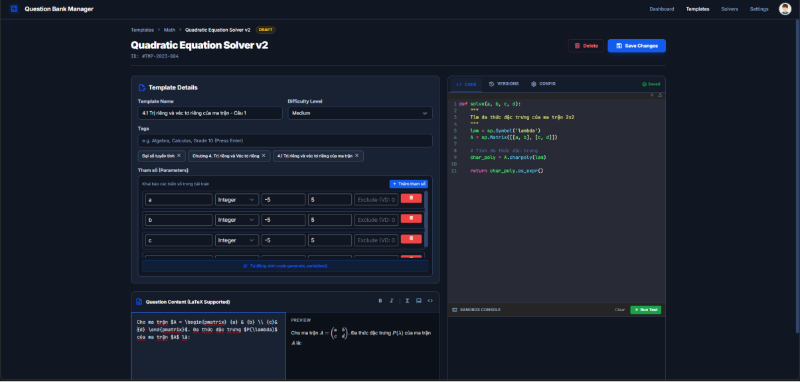

<div align="center">
  <h1>🧮 MathBank</h1>
  <p><strong>Hệ thống Tự động Sinh Ngân hàng Câu hỏi Toán học Thông minh</strong></p>
  
  [](https://opensource.org/licenses/MIT)
  [](https://www.python.org/)
  [](https://www.latex-project.org/)
</div>

---

## 1. 📖 Giới thiệu (Về Dự án)
**MathBank** là một ứng dụng tự động hóa quy trình xây dựng, quản lý và trích xuất ngân hàng câu hỏi Toán học. Dự án kết hợp sức mạnh của Trí tuệ Nhân tạo (AI/LLMs) và các công cụ tính toán biểu tượng để tự động sinh ra các bài toán đa dạng, kèm theo lời giải chi tiết và định dạng chuẩn xác.

## 2. 🎯 Tại sao dự án này tồn tại? (Motivation)
**Vấn đề:** Giáo viên, giảng viên và những người làm công tác giáo dục thường mất rất nhiều thời gian để biên soạn đề thi, bài tập. Việc đảm bảo độ đa dạng của câu hỏi, tính chính xác của đáp án, và đặc biệt là việc gõ các công thức Toán học phức tạp là một rào cản lớn.

**Giải pháp & Đối tượng hưởng lợi:**
MathBank ra đời nhằm giải quyết triệt để vấn đề này bằng cách tự động sinh câu hỏi và xuất bản trực tiếp dưới định dạng tài liệu học thuật. 
- **Giáo viên/Giảng viên:** Tiết kiệm 80% thời gian soạn đề, dễ dàng tạo ra nhiều mã đề khác nhau.
- **Học sinh/Sinh viên:** Có nguồn bài tập phong phú để tự luyện tập.
- **Cơ sở giáo dục:** Chuẩn hóa ngân hàng câu hỏi dùng chung.

## 3. ✨ Tính năng chính (Features)
### Backend
- **Tự động sinh câu hỏi (Auto-Generation):** Sử dụng các thư viện toán học để tự động tạo ma trận đề thi với các tham số ngẫu nhiên nhưng vẫn đảm bảo tính logic.
- **Tích hợp AI:** Hỗ trợ sinh câu hỏi ngữ cảnh đa dạng thông qua API của các mô hình ngôn ngữ lớn (LLMs).
- **Hỗ trợ LaTeX mạnh mẽ:** Mọi câu hỏi và đáp án đều được render và xuất ra dưới dạng code LaTeX chuẩn, sẵn sàng để compile thành PDF.
- **Quản lý CSDL (Database):** Lưu trữ, phân loại câu hỏi theo độ khó, chủ đề, môn học.

### Frontend
- **Giao diện trực quan:** Dashboard quản lý thống kê số lượng câu hỏi, đề thi.
- **Preview Live LaTeX:** Xem trước công thức Toán học ngay trên trình duyệt mà không cần cài đặt phần mềm bên thứ ba.
- **Custom Quiz Builder:** Giao diện kéo thả/chọn lọc để tự tạo một đề thi hoàn chỉnh và tải xuống dưới dạng `.tex` hoặc `.pdf`.

## 4. 🛠 Công nghệ & Công cụ sử dụng (Tech Stack)
- **Ngôn ngữ chính:** Python, JavaScript/TypeScript.
- **Backend Framework:** FastAPI / Flask (hoặc Django).
- **Toán học & Tính toán:** `SymPy` (tính toán đại số và sinh công thức).
- **AI / NLP:** Tích hợp mô hình ngôn ngữ lớn (Gemini API) cho các bài toán tư duy/lời văn.
- **Frontend:** ReactJS / Next.js, Tailwind CSS.
- **Tài liệu & Hiển thị:** LaTeX, MathJax / KaTeX.

## 5. 📂 Cấu trúc thư mục (Directory Structure)
```text
MathBank/
├── assets/                           # Thư mục chứa hình ảnh, sơ đồ, tài nguyên tĩnh cho README
├── backend/                          # Source code xử lý logic phía server (Python)
│   ├── migrations/                   # Quản lý các phiên bản cập nhật cơ sở dữ liệu
│   ├── Test.json                     # File chứa dữ liệu test mẫu
│   ├── app.py                        # File khởi chạy chính của server backend
│   ├── clear_database.py             # Script hỗ trợ dọn dẹp/reset cơ sở dữ liệu
│   ├── config.py                     # Chứa các cấu hình hệ thống (Database URI, API keys,...)
│   ├── database.py                   # Cấu hình kết nối tới Database
│   ├── models.py                     # Định nghĩa cấu trúc các bảng trong CSDL (ORM models)
│   ├── requirements.txt              # Danh sách các thư viện Python cần cài đặt
│   ├── services.py                   # Logic nghiệp vụ chính xử lý API
│   └── solvers.py                    # Các module thuật toán, sinh và giải câu hỏi toán học (SymPy)
├── frontend/                         # Giao diện người dùng (HTML)
│   ├── Create a question.html        # Giao diện tạo/thêm câu hỏi mới
│   ├── Question bank.html            # Giao diện quản lý ngân hàng câu hỏi
│   ├── Template_management.html      # Giao diện quản lý các mẫu đề thi
│   ├── assignment.html               # Giao diện quản lý và giao bài tập/đề thi
│   ├── dashboard.html                # Bảng điều khiển tổng quan (thống kê)
│   ├── subject_management.html       # Giao diện quản lý môn học, chủ đề
│   ├── template.html                 # Mẫu giao diện chung
│   └── warehouse.html                # Kho lưu trữ đề thi, tài liệu
├── .gitignore                        # Các file, thư mục cấu hình không đẩy lên GitHub
└── Báo cáo.pdf                       # File tài liệu báo cáo chi tiết của dự án
```
## 6. 🚀 Cài đặt & Khởi chạy (Getting Started)
Dưới đây là hướng dẫn để chạy dự án trên máy local.

### Yêu cầu hệ thống (Prerequisites)
- Python 3.9+
- Node.js 16+ & npm/yarn
- (Tùy chọn) MiKTeX/TeX Live nếu muốn compile PDF trực tiếp ở backend.

### Cài đặt Backend
1. Clone repository:
```bash
git clone [https://github.com/ShNam12/MathBank.git](https://github.com/ShNam12/MathBank.git)
cd MathBank/backend
```

2. Tạo môi trường ảo và kích hoạt:
```bash
python -m venv venv
source venv/bin/activate  # Trên Windows dùng: venv\Scripts\activate
```
3. Cài đặt các thư viện phụ thuộc:
```bash
pip install -r requirements.txt
```
4. Thiết lập biến môi trường (Tạo file .env và thêm API keys nếu dùng AI):
```bash
AI_API_KEY=your_api_key_here
DATABASE_URL=your_db_connection_string
```
5. Chạy server:
```bash
python main.py
# Server sẽ chạy tại http://localhost:8000
```
### Cài đặt Frontend

1. Mở một terminal mới, đi tới thư mục frontend:
```bash
cd MathBank/frontend
```
2.Cài đặt dependencies:
```bash
npm install
```
3. Khởi chạy ứng dụng web:
```bash
npm run dev
# Ứng dụng sẽ chạy tại http://localhost:3000
```

## 7. 💡 Hướng dẫn sử dụng (Usage)
1.Truy cập http://localhost:3000 và đăng nhập.

2. Tại màn hình Dashboard, chọn "Tạo đề thi mới".

3. Chọn các tham số:

- Chủ đề: Ví dụ: Đại số tuyến tính, Giải tích...

- Độ khó: Cơ bản, Vận dụng, Vận dụng cao.

- Số lượng: 40 câu trắc nghiệm.

4. Nhấn Generate. Hệ thống (thông qua Python & SymPy) sẽ tính toán và trả về kết quả.

5. Kiểm tra lại câu hỏi trên màn hình Live Preview.

6. Chọn Export -> Xuất file LaTeX (.tex) hoặc tải xuống bộ câu hỏi.

## 8. 📸 Giao diện hệ thống (Screenshots)

Dưới đây là một số hình ảnh thực tế về giao diện và luồng hoạt động của **MathBank**, giúp bạn có cái nhìn trực quan hơn về hệ thống:

### 📊 Bảng điều khiển tổng quan (Dashboard)
Giao diện chính dành cho người dùng để theo dõi thống kê, quản lý số lượng câu hỏi, đề thi và các hoạt động gần đây.


### ⚙️ Tự động sinh câu hỏi (Generate Questions)
Khu vực thiết lập các tham số như môn học, chủ đề, mức độ khó và số lượng câu hỏi mong muốn. Hệ thống sẽ tiếp nhận yêu cầu và tự động sinh ra bộ câu hỏi tương ứng.



### 📝 Hỗ trợ thiết lập Template thủ công và hiển thị mẫu câu hỏi thông qua LaTeX (LaTeX Preview & Export)
Mọi công thức toán học đều được render trực tiếp trên trình duyệt. Người dùng có thể xem trước nội dung chính xác và xuất đề thi dưới dạng file `.tex` hoặc mã code LaTeX chuẩn xác.


